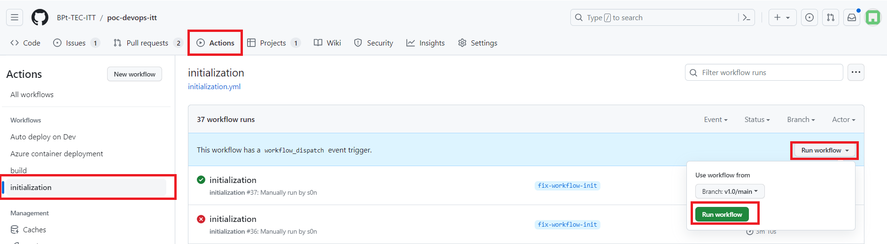
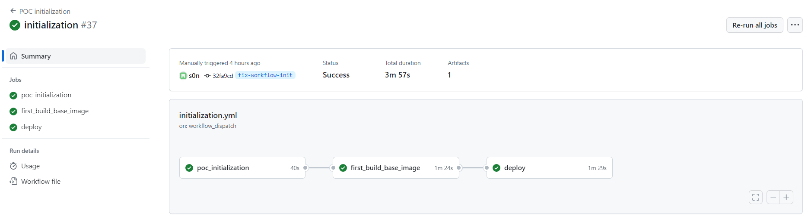
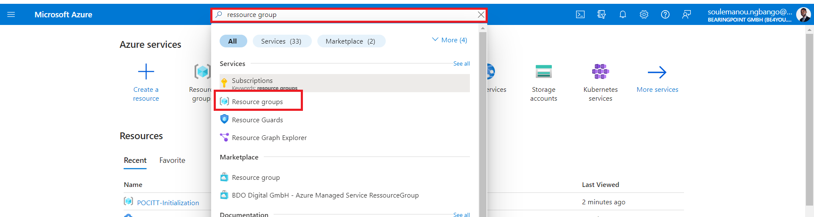
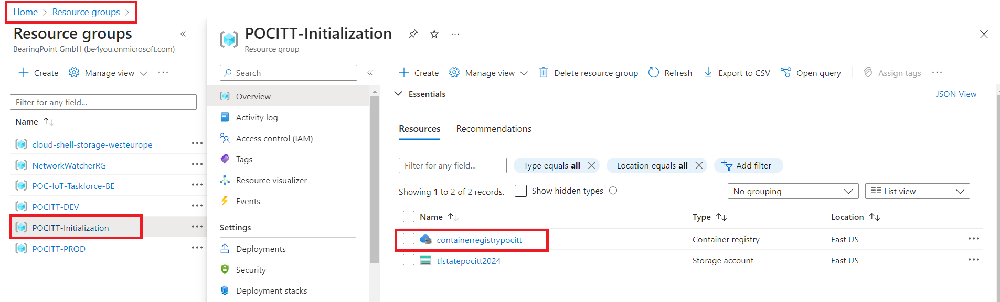
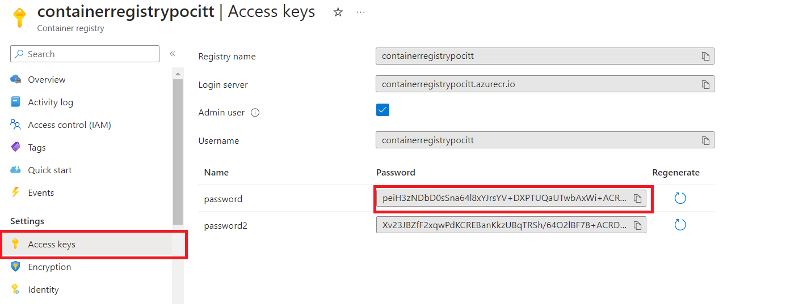
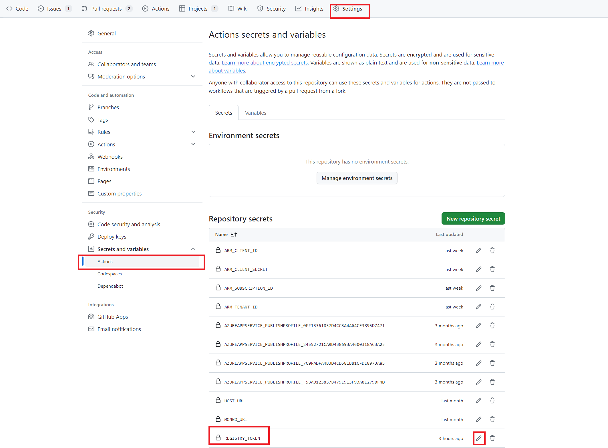
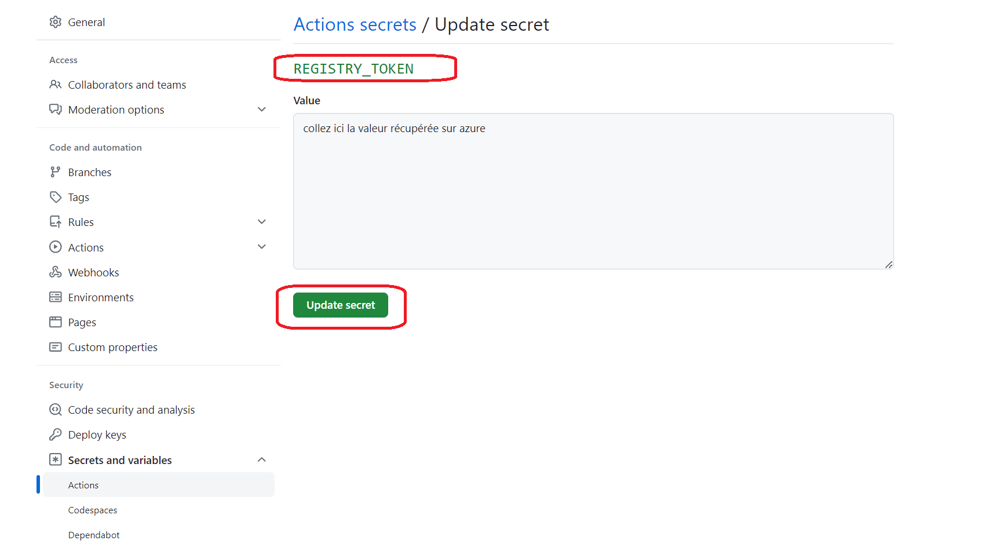
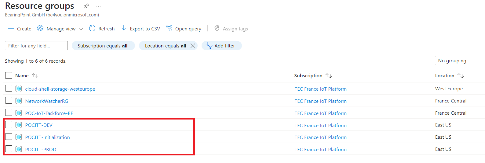

# DevOps : A demo of tools and best-practices

[](https://github.com/martinmouly/poc-devops-itt/actions/workflows/build.yml)  


[](https://sonarcloud.io/summary/new_code?id=BPt-TEC-ITT_poc-devops-itt)
[](https://sonarcloud.io/summary/new_code?id=BPt-TEC-ITT_poc-devops-itt)
[](https://sonarcloud.io/summary/new_code?id=BPt-TEC-ITT_poc-devops-itt)
[](https://sonarcloud.io/summary/new_code?id=BPt-TEC-ITT_poc-devops-itt)
[](https://sonarcloud.io/summary/new_code?id=BPt-TEC-ITT_poc-devops-itt)

[](https://sonarcloud.io/summary/new_code?id=BPt-TEC-ITT_poc-devops-itt)


This project aims to demonstrate the common tools and best-practices around DevOps methodology. DevOps is the standard methodology in the software development process. Used as a set of practices and tools, DevOps integrates and automates the work of software development (Dev) and IT operations (Ops) as a means for improving and shortening the systems development life cycle. DevOps methodology allow teams working on software development projects to deliver new version of their product very frequently, and enhances the agility and flexibility of the processes.


The code stored in this repository is our mock web app. It's a simple CRUD web application allowing a user to create, read, update and delete users. The stack used for the web app is NodeJS Express with EJS, and we used MongoDB as our DBMS.

### Descritpion du repo

- La **racine de repo** contient le code de l'application à dépoyer
- Le dossier **Containerization** : contient le code Terraform création de ressources sur Azure
- Le dossier **.gihub/workflows** : contien les workflows qui permettent d'automatiser certaines actions
  - **build.yml** : build l'application et faire passer tests d'intégration et de qualité de code
  - **build-image.yml** : Construire une image docker et la déposer dans un registre de conteneur
  - **azure-deploy.yml** : dépoyer une application via le service de conteneurisation d'Azure

### Prérequis

- Avoir le rôle **Maintain** ou **Admin** sur le repo [poc-devops-itt](https://github.com/BPt-TEC-ITT/poc-devops-itt) sur le projet git : afin de pourvoir accéder à l'onglet "action" pour lancer les pipelines et mettre à jour les variables secretes du projet
- Avoir un compte utilisateur Azure (Contibutor role) : pour accéder au portail Azure et accéder aux ressources qui seront créées par les pipeline

## Initialisation du PoC

- Lancez le pipeline **initialization** depuis l'onget "Action".



Ce pipeline pemettra de :
  - Créer un **registre de conteneur** avec une première (1.0) image version de l'application conteneurisée
    - Déployer une première version de l'application dans les environnements de recette et de production
      - environnement de **recette** : <http://test-poc-devops.eastus.azurecontainer.io:3000/>
      - environnement de **production** : <http://prod-poc-devops.eastus.azurecontainer.io:3000/>
  - Mettez à jour le secret **REGISTRY_TOKEN** (Settings > Secretes and variables > Actions > Repository secrets)
    - Récupérez la valeur du registry token sur [Azure](https://portal.azure.com/#home)
    
    
    
    - Puis mettez à jour le secret Registry token sur [github](https://github.com/BPt-TEC-ITT/poc-devops-itt)
    
    

Notes :

- L'exécution du pipeline **initialization** peut prendre plusieurs minutes (5 mins). A la fin de l'exécution du pipeline, vous pourrez vérifier que les ressources ont bien été créées sur le cloud Azure

- Si le pipeline échoue, ouvrez le [portail Azure](https://portal.azure.com/#home) et supprimez les groupe de ressources **POCITT-Initialization, POCITT-DEV & POCITT-PROD** puis relancez le pipeline une fois que la suppression est effective (environ 5 mins)


## Exécution du PoC : PLAN -> CODE -> BUILD -> TEST -> DEPLOY

### 1 - PLAN

L'objectif de l'étape Plan est de faire une rapide démonstration des dashboards typiquement utilisés pour planifier et faire le suivi des devs en cours. Ici, on utilise le board du projet associé ce repo.  
Le board est déjà pré-configuré et le ticket sur lequel on va faire la démo est déjà créé. Il suffit de déplacer le ticket dans la colonne 'In progress'.   
  
    
  
### 2 - CODE, BUILD, TEST

Cette étape consiste à effectuer le dev. Dans le cadre du POC, nous proposons un dev très simple à effectuer : le header du website doit avoir une couleur différente. 
- En local : Voir les instructions en bas pour le dev en local. Créer une branche avec nom spécifique au dev, effectuer le dev dans cette branche, puis pousser la branche sur le remote.  
- Directement sur GitHub : Faire le dev directement dans le fichier correspondant, commit les changements en créant une nouvelle branche  
Pour effectuer le dev, aller dans le fichier assets/css/index.css et modifier la ligne 71.

Quand le dev a été fait sur la branche, ouvrir une pull request, ce qui va lancer un pipeline de build + test. (On peut alors passer le ticket dans la colonne 'Sent for PR' dans le dashboard).   
Si le pipeline fail, le bouton pour merger sera rouge (à ne pas merger)  
Si le pipeline se déroule correctement, la branche peut être mergée.  

Voici l'aperçu de la PR quand les checks sont correctement effectués :  
  
  

Merger ensuite la branche vers la branche principale.  

On peut enfin passer le ticket en 'Done', et passer au déploiement.  


### 3 - TEST : SCAN SONAR  
Afin de faire une démonstration plus poussée de Sonar, on peut volontairement inclure du mauvais code dans l'application afin de voir l'utilité d'un scan Sonar.  
Créer une nouvelle branche et inclure dans le fichier server/controller/controller.js ce bout de code :  
```javascript
let password = 'azerty1234';
while(true) {
    console.log(password);
    break;
}
```
Créer ensuite la pull request. Ce code va être detecté par le scan Sonar comme une vulnérabilité car il affiche un password en dur, ainsi qu'un bug car la boucle while est inutile.  
Le détail du scan sera disponible ici : https://sonarcloud.io/project/pull_requests_list?id=martinmouly_poc-devops-itt  
  


### 4 - DEPLOY (environnement de TEST)

#### Description

Cette étape permet de déployer la dernière version de l'application en environnement de [recette](http://test-poc-devops.eastus.azurecontainer.io:3000/).

**Notes** : Le déploiement ce fait automatiquement après avoir mergé une Pull Request sur la branche **main**. Vous pouvez voir les détails du déploiement dans l'onglet **action**

### 4bis - DEPLOY (environnement de PROD)

Cette étape permet de déployer la dernière version de l'application en environnement de Production.

#### Comment lancer le workflow ?

Dans l'onglet "**Action**" du repo git, lancer le workflow **Azure container deployment** avec les paramètres :

- Deployment environment : **prod**
- Application version : **latest**

A la fin de l'exécution du workflow, vous pouvez vérifier que la dernière version de l'application a bien été dépoyée en [PROD](http://prod-poc-devops.eastus.azurecontainer.io:3000/) : <http://prod-poc-devops.eastus.azurecontainer.io:3000/>


**Note** : Il est possible de voir les détails d'exécution du workflow en cliquant sur le nom du workflow.


### 5 - Supprimer les ressources

#TODO(Soulémanou) workflow de suppression des ressources Azure à mettre en place.

## For local development

If you want to use this project to demonstrate DevOps tools and best-practices, or if you simply want to participate in the project's maintenance, you might need to start the project in a local environment.
To start the project in a local environment : 

- Create a .env file in the root folder and add these 2 variables :
  ```
  MONGO_URI="<mongo_uri>"
  HOST_URL="http://localhost:3000"
  ```
  Ask Martin Mouly or Soulemanou Ngbango for the MONGO_URI variable. It containes the credentials to connect to the MongoDB database.

- Once you've added the .env file, you're good to go, simply run these 2 commands to build the project and start the local server :
  ```
  npm install
  ```
  ```
  npm start
  ```

Finally, go to <http://localhost:3000> to visualize the app.
