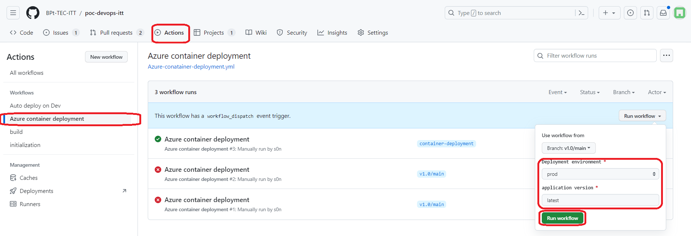
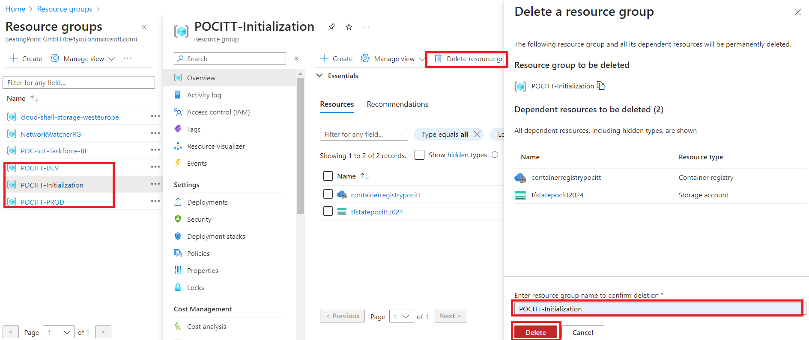

# DevOps : A demo of tools and best-practices

[](https://github.com/martinmouly/poc-devops-itt/actions/workflows/build.yml)  

[](https://sonarcloud.io/summary/new_code?id=BPt-TEC-ITT_poc-devops-itt)
[](https://sonarcloud.io/summary/new_code?id=BPt-TEC-ITT_poc-devops-itt)
[](https://sonarcloud.io/summary/new_code?id=BPt-TEC-ITT_poc-devops-itt)
[](https://sonarcloud.io/summary/new_code?id=BPt-TEC-ITT_poc-devops-itt)
[](https://sonarcloud.io/summary/new_code?id=BPt-TEC-ITT_poc-devops-itt)

[](https://sonarcloud.io/summary/new_code?id=BPt-TEC-ITT_poc-devops-itt)

## DevOps Quest 🌈🚀

🆘 Le Royaume Azure est en danger ! Bowser réclame une **nouvelle couleur pour son royaume, et il la veut pour hier** ! En tant que **Super DevOps Bros**, utilisez GitHub, Terraform, et la magie d'Azure pour déployer la teinte parfaite en un temps record !

Bonne chance, héros DevOps ! 🍄✨

## #1. Préparation du terrain

**I. 🚀Lancement pipeline d'initialisation :**

La première étape consiste à activer le super pipeline d'initialisation 🕹️ qui permettra de :

- Créer un registre de conteneur avec une première version de notre application 📦
- Déployer cette version dans les environnements de test et de production

1. **Rendez-vous sur le repository GitHub : [https://github.com/BPt-TEC-ITT/poc-devops-itt](https://github.com/BPt-TEC-ITT/poc-devops-itt), plus précisément sous l'onglet "Action".**
2. **Sélectionnez le workflow "Initialisation" et lancez le en cliquant sur "Run Workflow"**


L'initialisation peut prendre quelques minutes, vérifiez bien le succès du déploiement via les liens ci-dessous :

- **Environnement de test** (utilisez un réseau personnel, le réseau de CBX peut restreindre l'accès) : [http://test-poc-devops.eastus.azurecontainer.io:3000/](http://test-poc-devops.eastus.azurecontainer.io:3000/)
- **Environnement de production** (utilisez un réseau personnel, le réseau de CBX peut restreindre l'accès) : [http://prod-poc-devops.eastus.azurecontainer.io:3000/](http://prod-poc-devops.eastus.azurecontainer.io:3000/)


**II.🔍 Récupération du mot de passe sur Azure :**

🚨 Le lancement du super pipeline d'initialisation a généré un nouveau mot de passe. Il est temps de mettre à jour le secret **REGISTRY_TOKEN**.

**1. Allez sur le portail [Azure](https://portal.azure.com/#home)**

**2. Cherchez "Groupes de ressources".**


**3. Ouvrez la ressource POCITT-Initialization.**


**4. Dans "containerregistrypocitt", copiez le mot de passe depuis "Clés d'accès".**


**5. Retournez sur GitHub pour mettre à jour le secret REGISTRY_TOKEN.**


Les préparatifs sont maintenant terminé !

*Remarques :*

- *L'initialisation peut prendre jusqu'à 5 minutes. Vérifiez que toutes les ressources sont correctement créées sur Azure. Si l'initialisation échoue, supprimez les ressources concernées sur Azure et relancez le pipeline.*
- *Si la section security n'est pas visible => vous n'avez pas les droits suffisants. Assurez vous d'avoir les droits Admin ou Owner sur le reposiroty*

## #2. La mission 🎯

Vous êtes face à un défi passionnant : changer la couleur de l'en-tête du site web selon les préférences de Bowser. Nous vous guiderons à travers ce défi en 5 étapes clés :

- **PLAN** : Planifier les changements/développements qui vont être effectués (Dashboard github)
- **CODE** : écrire le code
- **BUILD** : Construire une nouvelle version de l'application prennant en compte les modifications/développements effecttués
- **TEST** : Test automatisés (qualité de code)
- **DEPLOY** : Déploiement de la nouvelle version de l'application en environnement de production et de test.

1. **PLAN**

- Un ticket vous a été attribué sur le tableau de projet : [Tableau de projet](https://github.com/orgs/BPt-TEC-ITT/projects/1/views/1)
- **Prenez en main ce ticket et montrez votre engagement en le déplaçant dans la colonne 'En cours'**. C'est le début de notre voyage pour découvrir les outils de planification et suivi de projet.

2. **CODE, BUILD, TEST 🔧**

Maintenant, place à l'action. Le but est simple : modifier l'apparence de l'application directement sur github ou en local.

- *Directement sur GitHub* : appliquez vos modifications directement dans le fichier de style.
  1. **Ouvrez et modifiez le fichier assets/css/index.css et modifier la ligne 71 (choisir une nouvelle couleur)**
  2. **Ouvrez une Pull Request,  ce qui lancera un pipeline de buid + test.**
  3. **Faire passer le ticket dans la colonne "Sent for PR" dans le dashboard.**
  4. **Après vos modifications, créez une pull request pour lancer le processus de vérification**. Si tout est correct, vous pouvez fusionner vos changements.
      - Si le pipeline fail, le bouton pour merger sera rouge (Ne pas merger)
      - Si le pipeline se déroule correctement, la branche peut être mergée.

 Ci-dessous, un exemple de Pull Request:
 

- *En local* : (voir section *For local developement* en bas de page).

*Bonnes pratiques :*

- *Faire les développement en local après avoir cloné le repository plutôt que de faire les développements directement sur github*
- *Valider les pull requests par d'autres membres de l'équipe de développement avant de les merger*

3. **TEST : SCAN SONAR 🔍**

Pour illustrer l'importance des tests, incluons délibérément un problème dans notre code. Ceci démontrera l'utilité d'un outil comme Sonar pour repérer les vulnérabilités et les bugs.

- **Créez une nouvelle branche et ajoutez le bout de code ci-dessous dans le fichier server/controller/controller.js.**

```
let password = 'azerty1234';
while(true) {
    console.log(password);
    break;
}
```

- **Créez ensuite une pull request**. Le code ajouté précédemment va être detecté par le scan Sonar comme une vulnérabilité car il affiche un password en clair, ainsi qu'un bug car la boucle while est inutile.
Le détail du scan sera disponible [ici](https://sonarcloud.io/project/pull_requests_list?id=BPt-TEC-ITT_poc-devops-itt) !


4. **DEPLOY 🚀**
A cette étape, nous allons déployer la nouvelle version de l'application (prennant en compte les modifications) sur les environnements de Test et de Production.

- **Déploiement sur l'environnement de Test** : Il se fait automatiquement lorsqu'une pull request est mergée sur la branche principale (v1.0/main). Accédez à [l'environnement de TEST](http://test-poc-devops.eastus.azurecontainer.io:3000/) pour vérifier que les dernières modifications ont bien été déployées.

- **Déploiemement en environnement de Production**
Maintenant qu'on s'est rassurés que les modifications déployées en environnement de test correspondent à nos attentes, nous allons dépoyer en production.
  - Dans l'onget "Action", lancez le pipeline "Azure container deployment" avec les paramètres ci-dessous :
    - Deployment environment : prod
    - Application version : latest

  
  Une fois l'exécution du pipeline terminé, accédez à [l'environnement de Production](http://prod-poc-devops.eastus.azurecontainer.io:3000/) pour vérifier que les modifications ont été correctement appliquées.

🎉🥳 **Bonne nouvelle ! Bowser Bug est conquis par la nouvelle version de l'application déployée en Production. Ouf !** 🎉🥳

## #3. Nettoyage final ✨

Avant de clore notre aventure, n'oubliez pas de nettoyer derrière vous en supprimant les groupes de ressources Azure pour éviter des frais inutiles.



Pour les développeurs souhaitant expérimenter localement, suivez les instructions dans la section "For local development" pour démarrer le projet dans votre environnement local.

## Générique de fin 🎬

🌟 Bravo à vous, intrépides héros du Royaume DevOps, pour avoir mené à bien chaque étape de cette quête ! Vous avez une fois de plus sauvé le royaume !🌟

🏆 Continuez à embrasser les défis technologiques avec la même détermination, et rappelez-vous toujours que le ciel du Royaume DevOps est la limite! Merci pour votre engagement et votre excellence 🏆

Prenez un moment pour célébrer votre réussite, car vous êtes désormais des champions certifiés du DevOps Mario Adventure! 🎉🍄✨

À la prochaine aventure DevOps! 🚀🎮

## For local development

If you want to use this project to demonstrate DevOps tools and best-practices, or if you simply want to participate in the project's maintenance, you might need to start the project in a local environment.
To start the project in a local environment :

- Create a .env file in the root folder and add these 2 variables :
  ```
  MONGO_URI="<mongo_uri>"
  HOST_URL="http://localhost:3000"
  ```
  Ask Martin Mouly or Soulemanou Ngbango for the MONGO_URI variable. It containes the credentials to connect to the MongoDB database.

- Once you've added the .env file, you're good to go, simply run these 2 commands to build the project and start the local server :
  ```
  npm install
  ```
  ```
  npm start
  ```

Finally, go to <http://localhost:3000> to visualize the app.
