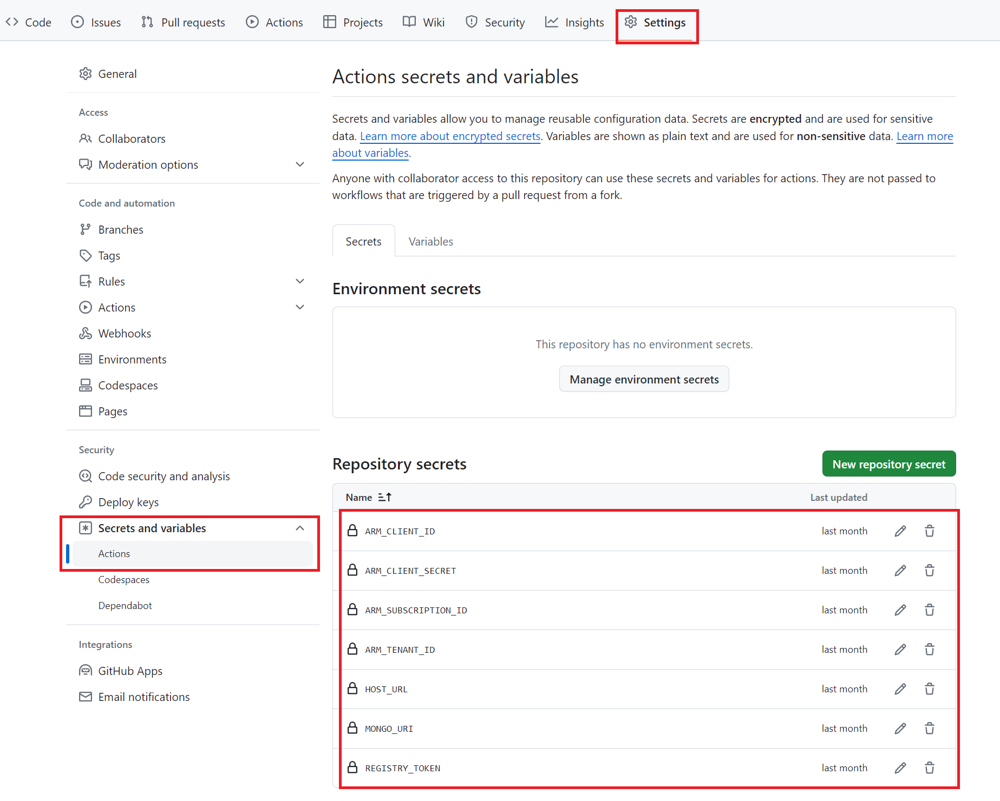
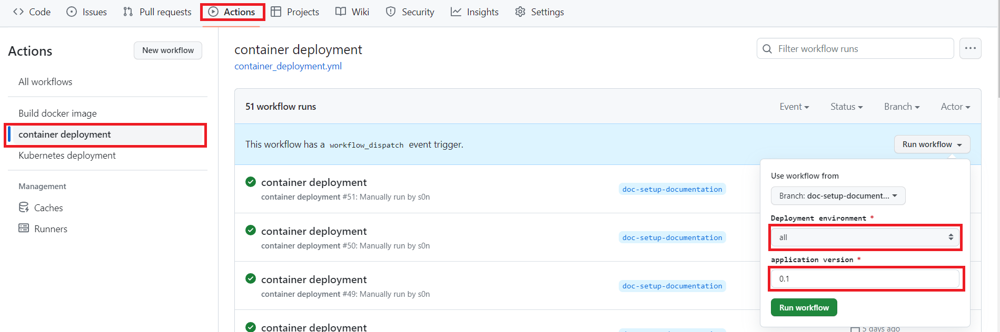
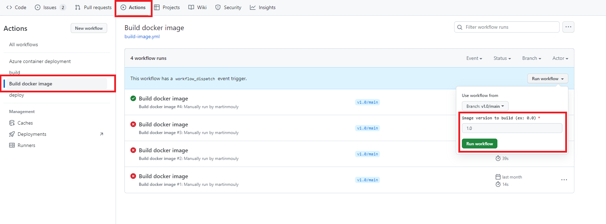
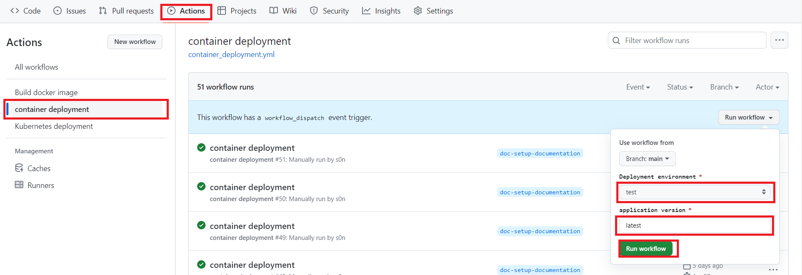
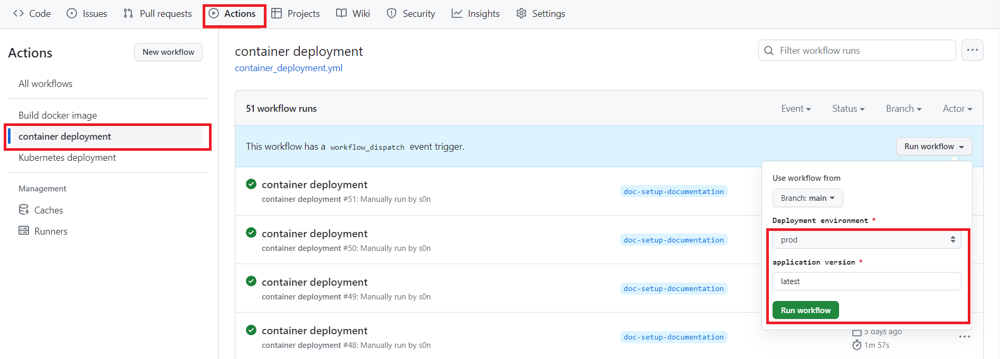

# DevOps : A demo of tools and best-practices
[](https://github.com/martinmouly/poc-devops-itt/actions/workflows/build.yml)
[](https://github.com/martinmouly/poc-devops-itt/actions/workflows/deploy.yml)


[](https://sonarcloud.io/summary/new_code?id=martinmouly_poc-devops-itt)
[](https://sonarcloud.io/summary/new_code?id=martinmouly_poc-devops-itt)
[](https://sonarcloud.io/summary/new_code?id=martinmouly_poc-devops-itt)
[](https://sonarcloud.io/summary/new_code?id=martinmouly_poc-devops-itt)
[](https://sonarcloud.io/summary/new_code?id=martinmouly_poc-devops-itt)

[](https://sonarcloud.io/summary/new_code?id=martinmouly_poc-devops-itt)  


This project aims to demonstrate the common tools and best-practices around DevOps methodology. DevOps is the standard methodology in the software development process. Used as a set of practices and tools, DevOps integrates and automates the work of software development (Dev) and IT operations (Ops) as a means for improving and shortening the systems development life cycle. DevOps methodology allow teams working on software development projects to deliver new version of their product very frequently, and enhances the agility and flexibility of the processes.


The code stored in this repository is our mock web app. It's a simple CRUD web application allowing a user to create, read, update and delete users. The stack used for the web app is NodeJS Express with EJS, and we used MongoDB as our DBMS.

### Descritpion du repo

- La **racine de repo** contient le code de l'application à dépoyer
- Le dossier **Continious Deployment** : contient Terraform création de ressource sur Azure
- Le dossier **.gihub/workflows** : contien les workflows qui permettent d'automatiser certaines actions
    - **build.yml** : build l'application et faire passer tests d'intégration et de qualité de code
    - **build-image.yml** : Construire une image docker et la déposer dans un registre de conteneur
    - **azure-deploy.yml** : dépoyer une application via le service de conteneurisation d'Azure

### Prérequis
- Avoir un compte utilisateur Azure (Contibutor role)
- Avoir un accès programmatic à Azure (Azure principal) : cet acces sera utilisé par Terraform pour gérer automatiquement les ressoures Azure via le pipeline Github Action.
Pour plus d'information, voir la [Documentation d'Azure](https://learn.microsoft.com/en-us/azure/developer/terraform/authenticate-to-azure?tabs=bash#create-a-service-principal)

## Comment lancer le PoC ?

### Configurer le repo Github
Pour mettre à jour les variables et les secrets du repo Git : **Settings > Secretes and variables > Actions > Repository Secrets**

- Metrte à jour les secrets et variables
    * Paramètres de connexion à la base de donnée
      * HOST_URL
      * MONGO_URI
    * Azure credentials
      * ARM_CLIENT_ID
      * ARM_CLIENT_SECRET
      * ARM_SUBSCRIPTION
      * ARM_TENANT_ID
    * Container registry token
      * REGISTRY_TOKEN 


## Initialisation du PoC
- Initialisation des configuration de Terraform (à faire en local)
    - #TODO (Soulémanou)

- Depuis l'onglet "**Action**", Lancer le workflow **Container deployment** avec les paramètres ci-dessous :
    - Deployment environment : **all**
    - Application version : **0.1**



L'exécution du pipeline déploiera la version sélectionnée (0.1 dans notre exemple) de l'application dans les environnements de **prod** et de **test** accessible vie la liens ci-dessous quelques minutes après l'exécution du workflow :

- PROD : http://prod-itt-poc-devops.eastus.azurecontainer.io:3000/
- TEST : http://test-itt-poc-devops.eastus.azurecontainer.io:3000/

## Exécution du PoC : PLAN -> CODE -> BUILD -> TEST -> DEPLOY

### 1 - PLAN
#TODO (Martin) : création de ticker pour nouvelle fonctionalité ou correction de bug

### 2 - CODE
#TODO (Martin): mettre à jour le code, nouvelle branche, merge, ...

### 3 - TEST
#TODO (Martin)
- Tests d'intégration
- Test de qualité de code

### 4 - BUILD
#### Description
Cette étape permet de construire une image de conteneur de l'application prenant en compte les dernières modifications faites sur la branche principale. Cette image sera stocké dans un registre de conteneur [ici](https://hub.docker.com/r/sngbango/app-poc/tags).
#### Comment lancer le workflow ?
Dans l'onglet "**Action**" du repo git, lancer le workflow **Build docker image**



Note : Pour les besoins du POC, nous utilisons temporairement [Docker Hub](https://hub.docker.com/r/sngbango/app-poc/tags) comme registre de conteneur.

### 4 - DEPLOY (environnement de TEST)
#### Description
Cette étape permet de déployer la dernière version de l'application en environnement de Test.

#### Comment lancer le workflow ?
Dans l'onglet "**Action**" du repo git, lancer le workflow **container deployment** avec les paramètres :
- Deployment environment : **test**
- Application version : **latest**

A la fin de l'exécution du workflow, vous pouvez vérifier que la dernière version de l'application a bien été dépoyée en [TEST](http://test-itt-poc-devops.eastus.azurecontainer.io:3000/) : http://test-itt-poc-devops.eastus.azurecontainer.io:3000/



**Note** : Il est possible de voir les détails d'exécution du workflow en cliquant sur le nom du workflow.

### 4bis - DEPLOY (environnement de PROD)

Cette étape permet de déployer la dernière version de l'application en environnement de Production.

#### Comment lancer le workflow ?
Dans l'onglet "**Action**" du repo git, lancer le workflow **container deployment** avec les paramètres :
- Deployment environment : **prod**
- Application version : **latest**

A la fin de l'exécution du workflow, vous pouvez vérifier que la dernière version de l'application a bien été dépoyée en [PROD](http://prod-itt-poc-devops.eastus.azurecontainer.io:3000/) : http://prod-itt-poc-devops.eastus.azurecontainer.io:3000/



**Note** : Il est possible de voir les détails d'exécution du workflow en cliquant sur le nom du workflow.


### 5 - Supprimer les ressources
#TODO(Soulémanou) workflow de suppression des ressources Azure à mettre en place.

## For local development
If you want to use this project to demonstrate DevOps tools and best-practices, or if you simply want to participate in the project's maintenance, you might need to start the project in a local environment.
To start the project in a local environment : 
- Create a .env file in the root folder and add these 2 variables :
  ```
  MONGO_URI="<mongo_uri>"
  HOST_URL="http://localhost:3000"
  ```
  Ask Martin Mouly or Soulemanou Ngbango for the MONGO_URI variable. It containes the credentials to connect to the MongoDB database.

- Once you've added the .env file, you're good to go, simply run these 2 commands to build the project and start the local server :
  ```
  npm install
  ```
  ```
  npm start
  ```

Finally, go to http://localhost:3000 to visualize the app.

